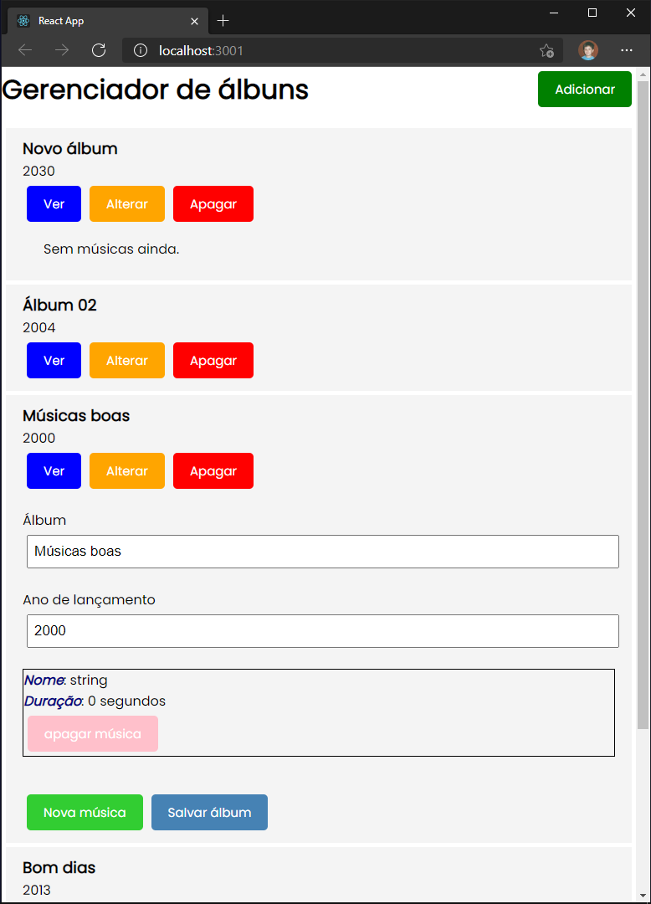

# AlbunsMusica
Trabalho final para o processo seletivo da Manager Saúde

## Enunciado

1) Faça uma API para cadastro de álbuns de música. Cada álbum deve possuir um nome, um ano de lançamento e uma lista de músicas. Cada música deve possuir um nome e uma duração em segundos. A API deve ser feita utilizando WebAPI e Entity Framework. Você deve implementar as quatro operações (GET, POST, PUT e DELETE).

2) Construa um front-end em React para consumir a API criada em (1). O resultado deve ser um CRUD completo.

## O resultado

## Principais referências consultadas

[Using the State Hook – React (reactjs.org)](https://reactjs.org/docs/hooks-state.html)

[Hooks API Reference – React (reactjs.org)](https://reactjs.org/docs/hooks-reference.html)

[React Router hooks will make your component cleaner - LogRocket Blog](https://blog.logrocket.com/react-router-hooks-will-make-your-component-cleaner/)

[Async Await – How to Wait for a Function to Finish in JS - FreeCodeCamp](https://www.freecodecamp.org/news/async-await-javascript-tutorial/)

[Node.js, lots of ways to block your event-loop - Medium](https://medium.com/voodoo-engineering/node-js-lots-of-ways-to-block-your-event-loop-and-how-to-avoid-it-b41f41deecf5)

[Using the Effect Hook – React (reactjs.org)](https://reactjs.org/docs/hooks-effect.html)

(e dezenas de perguntas no stackoverflow)

